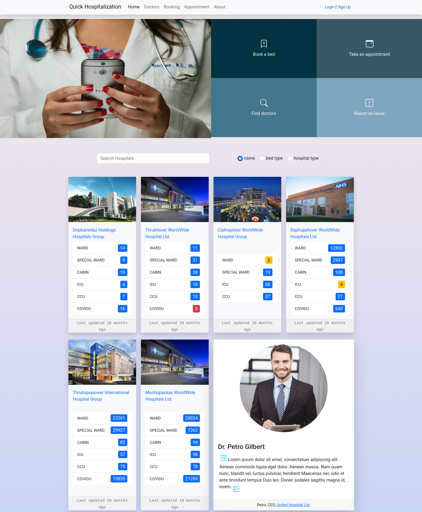
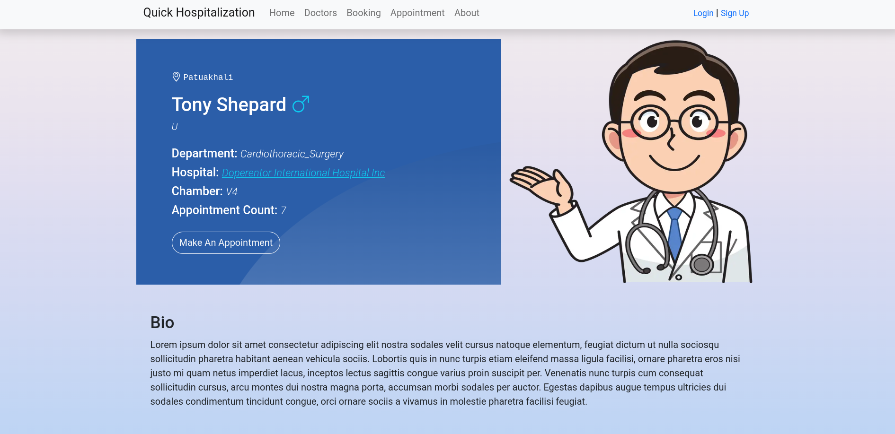

Quick Hospitalization is an online reservation system of available hospital beds from the vacancy data provided by the hospitals. This is a [Next.js](https://nextjs.org/) project designed with `Bootstrap` and `SASS`.

## **User Type**

The application maintains two levels of user:

- ### **Admin**
  In the admin type, the hospital administration maintains a handful of features and services offered by the institution. The application provides full control of data manipulation. The admin can choose to control a number of services and amenities to provide as an institution. Furthermore, the admin type provides functionality of addition, deletion, and editing of employee information to the institution.
- ### **Patient**
  Patient type is where the user can search up for a hospital and choose the required bed which is needed and reserve it with partial advance payment. The user is given an account with full control to personal data along with booking information. The user account is exposed to hospital information in order to get the required beds.

## **Admin Employee Roles**

- Admin
- DB Manager
- Editor

## **Used Languages, Frameworks & Tech**

- **HTML** - layout
- **CSS** - design
- **JS** - functionality
- **MySQL** - database schema
- **Prisma** - database ORM
- **Next.js — React-Framework**: backend
- **Bootstrap — CSS Framework**: frontend – design & outlook
- **SASS**: CSS pre-processor
- **Typescript — JS Superset**: full-stack, for type-safe code

## **Getting Started**

First, start your Xampp window and start the Apache and MySQL server. Then create a database namely `project_quick_hospitalization` and import the `project_quick_hospitalization.sql` file provided in the `resources` folder into the database server. 

Then head on to the project root folder and open a terminal. 

Run the following query : 

```node
npm install
```

Now paste the .env file provided in the project root folder and edit the values if needed such as DB username, password, port, etc. as per your machine. Necessary instructions are provided there. Then, run the production server from the root folder by typing the following command in CLI:

```node
npm run start
```



Now open [http://localhost:4001](http://localhost:4001) on your browser to see the website. The landing page is the first user view with a list of hospitals with their name and vacancies. The user can navigate between pages from the navbar.

Hospital administration can access the website from [http://localhost:4001/admin](http://localhost:4001/admin) where a registered hospital employee can login with their credentials. An admin will have full control over the hospital info management from the dashboard.

To register a hospital, head on to [http://localhost:4001/admin/signup](http://localhost:4001/admin/signup), and enter the required hospital info. On signup success, the user will be redirected to the dashboard where they have full control. The new employee is signed up as admin of the hospital.



The doctors portal can be accessed from [http://localhost:4001/doctor/login](http://localhost:4001/doctor/login) where the doctor has access to their own dashboard, manage appointments & their profile. 

API routes can be accessed on `http://localhost:4001/api/`[API-name]. This endpoint can be found in `pages/api/`. Files in this directory are treated as [API routes](https://nextjs.org/docs/api-routes/introduction) instead of React pages.

### **Things to Consider**

The variables in the `.env` file are crucial to run certain functionalities. The variable names and links to the service provider is given but the API key is to be collected beforehand to run the application in full potential.

### Learn More

To learn more about Next.js, take a look at the following resources:

- [Next.js Documentation](https://nextjs.org/docs) - learn about Next.js features and API.
- [Learn Next.js](https://nextjs.org/learn) - an interactive Next.js tutorial.
